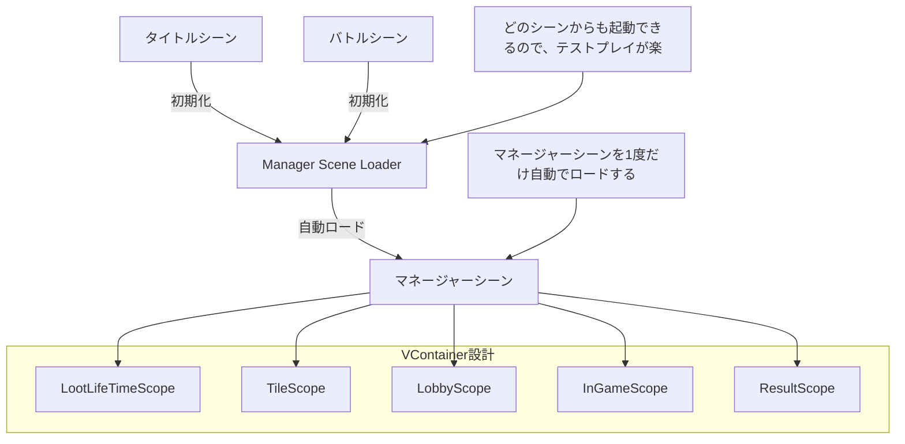

# AcquireSummerGameJamEarthTeam

## Unityのバージョン
`2022.3.39f1`

## 命名規則

### パスカルケース　HogeHoge

- クラス
- プロパティ
- Enum
- publicでstaticな変数
- const

```csharp
using UnityEngine;

namespace Hoge
{
    public class Hoge
    {
	private float _hoge = 0;
	public static float Hogehoge = 0;
        /// <summary> このインスタンスを保有するオブジェクトのタイプ </summary>
        public float Hoge => _hoge;

        /// <summary>
        /// ダメージを適用する
        /// </summary>
        /// <param name="damage"></param>
        public void HogeHoge(float damage)
        {
            //何かしらの処理
        }
    }

    /// <summary>
		/// Hoge
    /// </summary>
    public enum Hoge
    {
        None,
        Hoge,
        Foo,
    }

}
```

### アンダースコア＋キャメルケース　_hogeHoge

- privateなメンバ変数
- SerializeField

```csharp
using UnityEngine;

namespace Hoge
{
    public class Hoge
    {
	private float _hoge = 0;
    }
}
```

### キャメルケース　hoge

- ローカル変数

```csharp
using UnityEngine;

namespace Hoge
{
    public class Hoge
    {
	void Hoge()
	{
	    private float foo = 0;
	}
    }
}
```

### コメント

クラス、メソッドには必須

変数は変数名で分からないものは書く。

### 名前空間

スクリプトを入れるファイルに準拠する
例えばAsset/Project/Program/Script/SceneAのCoreにファイルを作る場合、
名前空間をProject.Program.Script.SceneAにしてください。

## ゲームジャム期間
`2024/08/06` ~ `2024/08/07`"

## ゲームジャム概要

## ゲームタイトル
`未定`

## ゲーム概要

## 制作メンバー


## クラス設計

## シーン遷移

